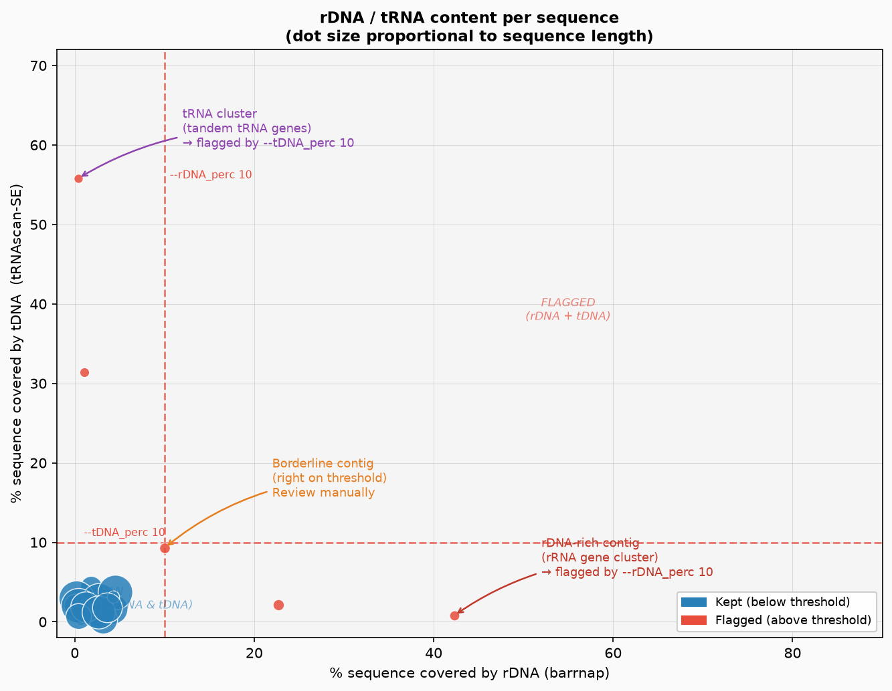
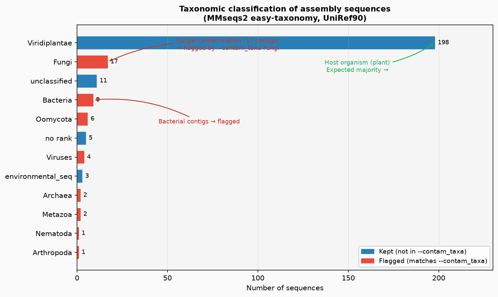
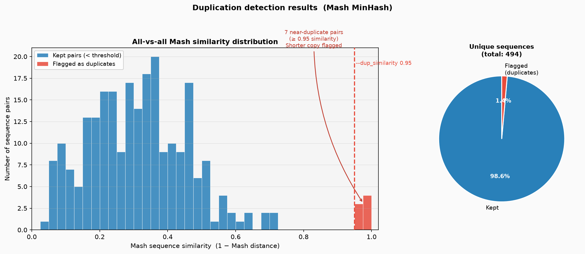

# Example outputs

This directory contains annotated example figures and tables that illustrate
what each YuggASMoth detection module produces.

The examples were generated from realistic synthetic data using
`generate_example_outputs.py`. Re-run that script at any time to regenerate
them:

```bash
python3 examples/generate_example_outputs.py
```

---

## Module 1 — rDNA / tRNA scatter plot

**Figure:** `figures/example_rDNA_tRNA.png`
**Table:** `tables/example.rDNA_tRNA.tsv`



Each dot is one assembly sequence. The **X axis** shows the percentage of the
sequence covered by rDNA annotations (barrnap), and the **Y axis** shows the
percentage covered by tDNA annotations (tRNAscan-SE). **Dot size is
proportional to sequence length.**

- **Blue dots** — sequences below both thresholds: kept in the assembly.
- **Red dots** — sequences above `--rDNA_perc` and/or `--tDNA_perc`: flagged
  for removal.

Key zones to look for:
- **Cluster in the bottom-left** — the healthy bulk of the assembly (clean,
  low rDNA / tDNA).
- **High-rDNA outliers** (right of the dashed vertical line) — rDNA-rich
  sequences, typically from the nucleolar organiser region (NOR). These often
  assemble as short, repetitive contigs.
- **High-tDNA outliers** (above the dashed horizontal line) — tRNA clusters,
  typically tandem arrays of tRNA genes found near telomeres or centromeres.
- **Borderline dots** (near the threshold lines) — review these manually
  before committing to filtering.

---

## Module 2 — Contamination bar chart

**Figure:** `figures/example_contamination.png`
**Table:** `tables/example.contamination.tsv`



Horizontal bars show the number of sequences assigned to each taxonomic group
by MMseqs2 easy-taxonomy (LCA algorithm). Groups matching `--contam_taxa` are
shown in **red**; all others in **blue**.

- The **host organism** (here Viridiplantae) dominates the bar chart — this is
  the expected majority.
- **Fungi** (17 contigs in this example) are the most common plant genome
  contaminant. YuggASMoth flags them because they are in `--contam_taxa`.
- **Bacteria, Oomycota, Viruses** appear at low frequency — these can be
  genuine contaminants from DNA extraction or the sequencing library.
- **unclassified / no rank** — sequences with no reliable taxonomic hit.
  These may be novel sequences or too divergent for the database used; do not
  remove them automatically.

---

## Module 3 — Duplication histogram and pie chart

**Figure:** `figures/example_duplications.png`
**Table:** `tables/example.duplications.tsv`



### Left panel — similarity histogram

Every pair of sequences is compared with Mash (MinHash sketches). The
histogram shows the distribution of **Mash similarity** (= 1 − Mash distance)
across all pairs.

- **Blue bars** — the bulk of sequence pairs: clearly distinct genomic regions
  with similarity well below `--dup_similarity`.
- **Red bars** — pairs above the threshold: near-identical sequences that
  likely represent the same genomic region assembled twice (e.g. because of
  heterozygosity, collapsed/expanded repeats, or a chimeric assembly).
- The **dashed red line** marks `--dup_similarity`. Move it left to be more
  aggressive (flag more pairs), right to be more conservative.

### Right panel — pie chart

Shows how many **unique sequences** are retained vs flagged. When a pair is
flagged the **shorter** sequence is removed; the longer is kept.

---

## Interpreting the outputs together

Run all three modules with `--skip_filtering` first to get a full picture:

1. Check the **rDNA/tRNA scatter** — are there clear outlier clusters, or is
   the distribution continuous? A continuous gradient suggests the thresholds
   need careful tuning.
2. Check the **contamination bar chart** — is the host taxon dominant? If
   non-plant taxa account for > 5% of sequences, investigate before filtering.
3. Check the **duplication histogram** — is there a clear gap between the main
   distribution and the duplicate cluster, or do they overlap? Overlapping
   distributions suggest you may be dealing with highly heterozygous regions
   rather than true assembly duplicates.
